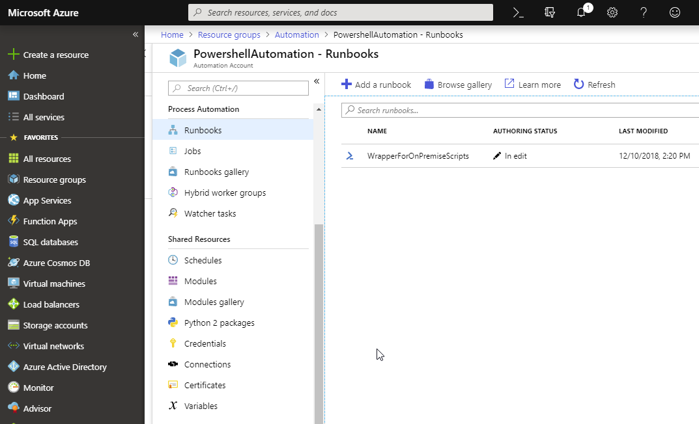
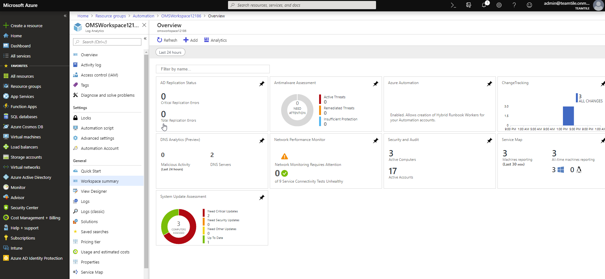

## 1. Create an Azure automation account

We need an Azure Automation Account. This is an account where we can store credentials, scripts (runbooks), certificates, ... We will use this account to run powershell scripts on premise. 

Run `./start.ps1 -DeelAzure` [:memo:](../Start.ps1)

4 scripts will run.

#### 1.1. Create Automation Account

`CreateAutomationAccount.ps1` [:memo:](../scripts/CreateAutomationAccount.ps1)

This script will create a resource group, an Automation account, an app registration and a service principal to be used with the app. The service principal will be granted `contributor` rights on the Azure tenant. All necessary details will be writen to a `AutomationContext.json` file. This file can be used by other scripts. 

#### 1.2. Create credentials in Automation Account

`CreateCredentialsInAutomationAccount.ps1` [:memo:](../scripts/CreateCredentialsInAutomationAccount.ps1)

This script will create a set of credentials to the Azure Automation account. These will be used when a runbook needs credentials to run on premise scripts.

#### 1.3. Upload WrapperScript to Azure

`UploadRunbook.ps1` [:memo:](../scripts/UploadRunbook.ps1)

We need a way to execute on premise scripts. An integration with source control systems is currently in preview. Another option is to upload all scripts to the storage account. I chose a different approach. Let's use a wrapper - `WrapperForOnPremiseScripts.ps1` which points to the script to run and pass some parameters. In our case all scripts are stored in a "shared" location from the vieuw of the virtual machines - `c:\vagrant_data\scripts\`. This wrapper allows us to run scripts on premise. 

`WrapperForOnPremiseScripts.ps1` [:memo:](../scripts/WrapperForOnPremiseScripts.ps1)

#### 1.4. Create Operations Manager Suite account

`CreateOMSWorkspace.ps1` [:memo:](../scripts/CreateOMSWorkspace.ps1)

This script will create an azure workspace with a PerNode license and activate the Azure automation solution in the workspace. 

The solutions are:

- AzureAutomation
- ServiceMap
- LogManagement
- NetworkMonitoring
- ChangeTracking
- AntiMalware
- Security

About [Microsoft Operations Manager](https://docs.microsoft.com/en-us/azure/azure-monitor/overview)

More information about the solutions can be found [here](https://docs.microsoft.com/en-us/azure/azure-monitor/insights/solutions). A complete [list](https://gallery.technet.microsoft.com/office/List-all-OMS-Gallery-546ee267) of solutions.

[Previous](../README.md) - [Index](./index.md) - [Next](./2.CreateTheMachines.md)