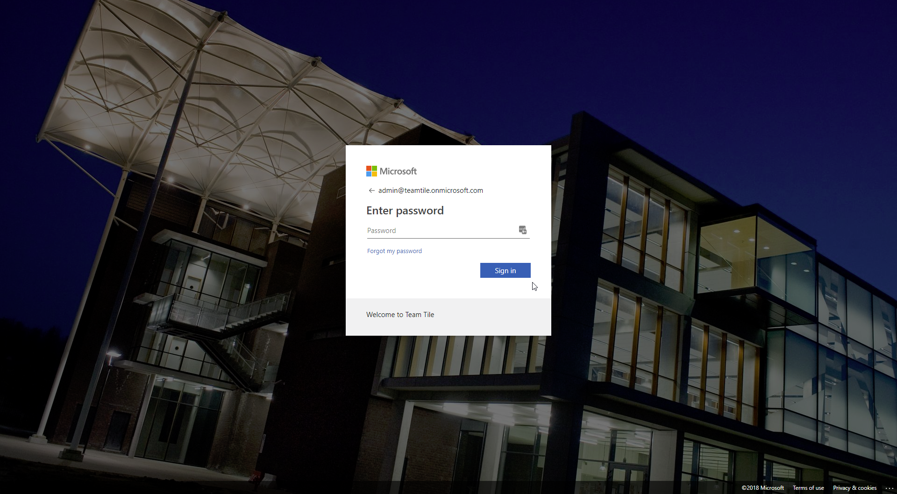

## 10. Branding

To empower corporate awareness, we need to brand our tenant. Our users will identify themselves with the company and recognize the brand / theme. 

Branding is also a requirement for Azure Identity Protection in one of the upcoming sections.

This is easily done in the Azure portal.

[Previous](./9.EMS.md) - [Index](./index.md) - [Next](./11.PublishApplication.md)