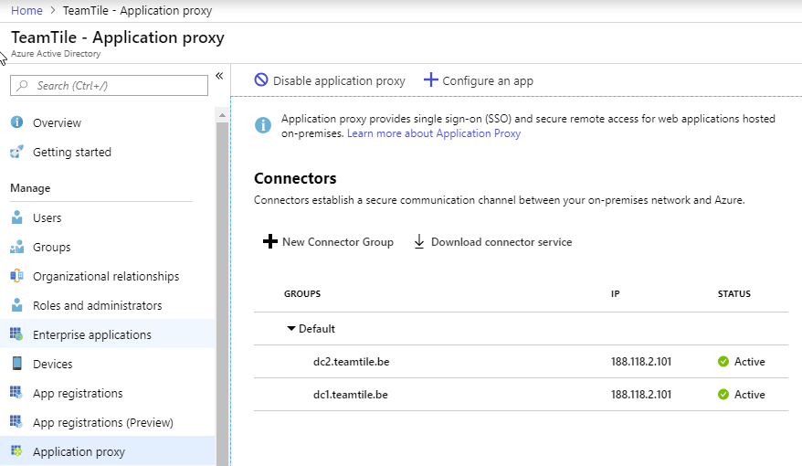

## 11. Publish Application with Azure AD Connect

A nice feature of Azure Active Directory (AAD) is the AAD proxy. This is a servive which creates an outbound connection to Azure. Applications published in AAD can be redirected to this outbound connection. The result is a published on-premise application **without** holes in the firewall. We can even link an existing domainname with custom label and a certificate to the application. 

To publish an application with AAD proxy we need to download and install the AAD proxy client.

After installing the connector both servers are available.

We can then create the application in the portal

- Create a new Enterprise Application for RDS web on [https://rds1.teamtile.be/rdweb](https://rds1.teamtile.be/rdweb)
- Change the url
- Upload the certificate
- Assign users to the application
- Create a new Enterprise Application for RD gateway
- Create a DNS record

The environment is now accessible form the Internet for everyone, with the necessary rights and a license, that can authenticate against Azure Active Directory.

[Vorige](./10.Branding.md) - [Index](./index.md) - [Volgende](./12.AzureIDProtection.md)