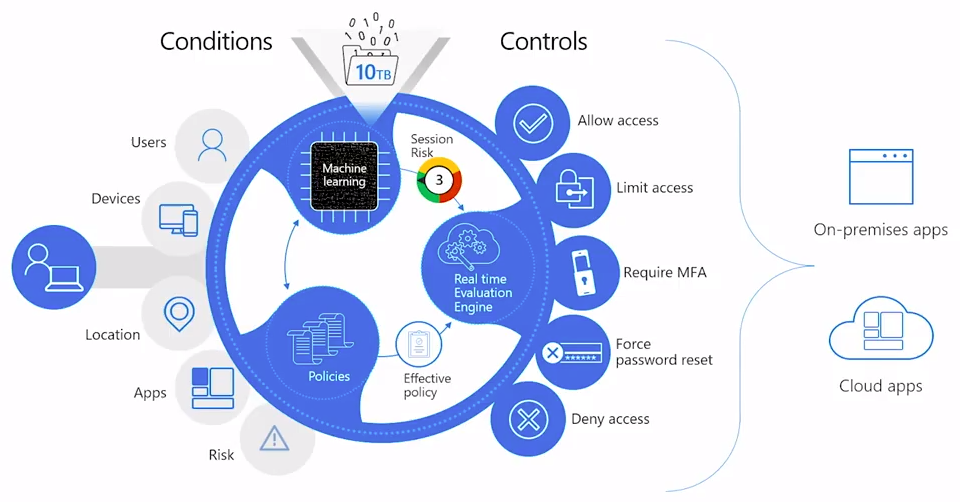
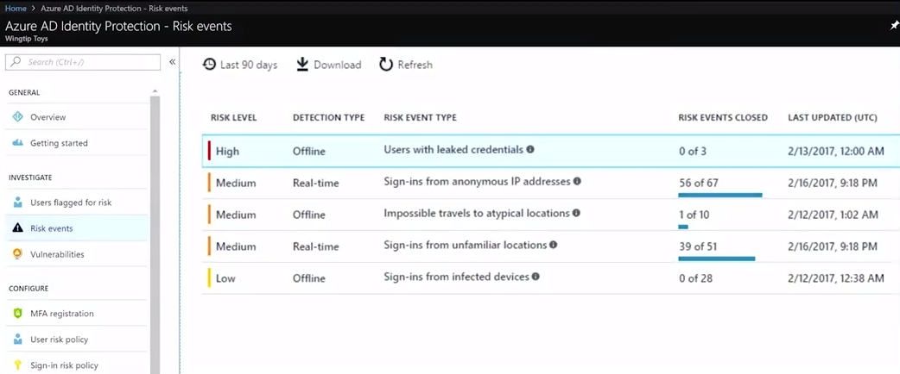

## 12. Azure ID protection

An extra feature that we can activate is [Azure ID Protection](https://docs.microsoft.com/en-us/azure/active-directory/identity-protection/). Identity protection is a set of mechanisms to grade the risk of breached credentials. Based on these grades the user can be challenged for an multi-factor authentication (MFA) request.

Indicators can be

- Leaked credentials (found on the darkweb)
- Sign-ins from anonymous IP addresses
- Impossible travel to atypical locations
- Sign-ins from infected devices
- Sign-ins from IP addresses with suspicious activity
- Sign-ins from unfamiliar locations

An interesting screencast from Microsoft can be found [here](https://www.youtube.com/watch?v=ZqT9hvJj4r4).

Enabling Azure ID protection is very easy

- Enable MFA registration (required)
- Set User risk policy (probability that a user account has been compromised)
- Set Sign-in risk policy (probability that a sign-in was not performed by the owner of the user account)
- Set an alert mail address

[Vorige](./11.PublishApplication.md) - [Index](./index.md) - [Volgende](./13.Intune.md)