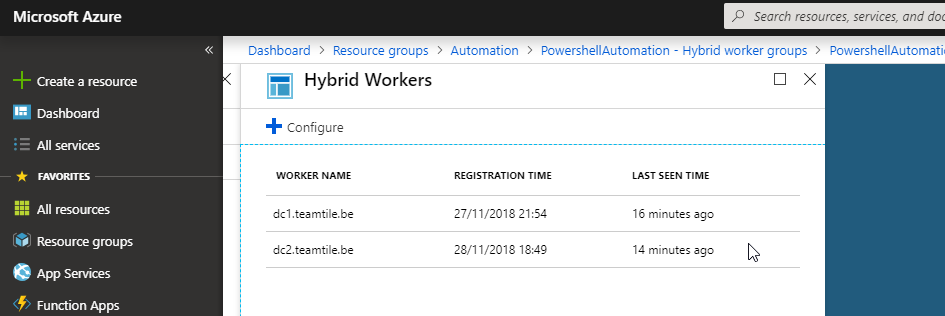

## 2. Create the machines

Now that the Azure infrastructure is in place, we need to install the virtual machines

Run `./start.ps1 -DeelVagrant` [:memo:](../Start.ps1)

This will setup will setup all servers in the Vagrant file. [:memo:](../Vagrantfile)

| Servername  | IP Address    | Function                  | Role(s)                                 |
| :---        | :---          | :---                      | :---                                    |
| dc1         | 192.168.20.11 | Domain controller 1       | DNS, DHCP, RDS licensing, DHCP          |
| dc2         | 192.168.20.12 | Domain controller 2       | DNS                                     | 
| rds1        | 192.168.20.21 | Remote desktop host 1     | RDS host                                |
| rdswa1      | 192.168.20.31 | Webserver 1               | RDS web access, RD gateway, RD broker   |
| fp1         | 192.168.20.41 | File & Print server 1     | Stores users profile disks              |

    EDIT: As I'm bound by the laws of physics and the limits of my machine we will only run dc1, dc2 and rds1.

After the servers are deployed, the scripts configured in the Vagrant file will run. The idea is to setup a basic environment.

| Servername  | Scripts                             |                                                           | To what end                                     |
| :---        | :---                                | :---:                                                     |:---                                             |
| dc1         | `InstallSoftwareWithChocolatey.ps1` | [:memo:](../scripts/InstallSoftwareWithChocolatey.ps1)    | Installs chocolatey .net 4.7.2                  |
|             | `InstallDomain.ps1`                 | [:memo:](../scripts/InstallDomain.ps1)                    | Install a new domain                            |
|             | `InstallDhcp.ps1`                   | [:memo:](../scripts/InstallDhcp.ps1)                      | Install a dhcp server & create scope            |
|             | `SetupAD.ps1`                       | [:memo:](../scripts/SetupAD.ps1)                          | Create a structure in Active Directory          |
|             | `AddUsers.ps1`                      | [:memo:](../scripts/AddUsers.ps1)                         | Create some users in Active Directory           |
|             | `InstallMonitoringAgent.ps1`        | [:memo:](../scripts/InstallMonitoringAgent.ps1)           | Installs the OMS agent                          |
|             | `InstallDependencyAgent.ps1`        | [:memo:](../scripts/InstallDependencyAgent.ps1)           | Installs the dependency agent                   |
|             | `AddUsers.ps1`                      | [:memo:](../scripts/AddUsers.ps1)                         | Add some users to Active Directory              |
| dc2         | `JoinDomain.ps1`                    | [:memo:](../scripts/JoinDomain.ps1)                       | Set dns servers and become member of the domain |
|             | `InstallDomain.ps1`                 | [:memo:](../scripts/InstallDomain.ps1)                    | Install domain controller in existing domain    |
|             | `InstallMonitoringAgent.ps1`        | [:memo:](../scripts/InstallMonitoringAgent.ps1)           | Installs the OMS agent                          |
|             | `InstallDependencyAgent.ps1`        | [:memo:](../scripts/InstallDependencyAgent.ps1)           | Installs the dependency agent                   |
| rds1        | `JoinDomain.ps1`                    | [:memo:](../scripts/JoinDomain.ps1)                       | Set dns servers and become member of the domain |
|             | `InstallSoftwareWithChocolatey.ps1` | [:memo:](../scripts/InstallSoftwareWithChocolatey.ps1)    | Installs chocolatey and chrome, SmarTTY         |
|             | `InstallMonitoringAgent.ps1`        | [:memo:](../scripts/InstallMonitoringAgent.ps1)           | Installs the OMS agent                          |
|             | `InstallDependencyAgent.ps1`        | [:memo:](../scripts/InstallDependencyAgent.ps1)           | Installs the dependency agent                   |

Notice that we install a monitoring agent and a dependency on each server with `InstallMonitoringAgent.ps1` and `InstallDependencyAgent.ps1`. 


#### Monitoring agent

The [Microsoft Monitoring Agent](https://docs.microsoft.com/en-us/azure/azure-monitor/platform/agent-windows) is a Microsoft Operations Manager agent that reports to the Operations Manager subscription (OMS) in Azure. The solutions installed in the OMS workspace use the data sent by the agent.

For the servers `dc1` and `dc2` we add some extra configuration for the Microsoft Monitoring agent. We register the agent as a [hybrid worker](https://docs.microsoft.com/en-us/azure/automation/automation-hybrid-runbook-worker). A hybrid worker executes scripts on premise. (See commands in vagrant file)



#### Dependency agent

The [Microsoft Dependency Agent](https://docs.microsoft.com/en-us/azure/azure-monitor/insights/service-map-configure) is an agent that monitors the processes running on the server and where they connect to. Using these agents we can create a map of dependencies and find out what servers is used for what. 

### Onboard machines

* Windows machines
* Linux manchines
  
#### Windows machines

Locations to watch `C:\Program Files\WindowsPowerShell`

```
# Install Microsoft Monitoring Agent
 .\InstallMonitoringAgent.ps1 -AutomationContextFile .\AutomationContext.json -Verbose

# Install Microsoft Dependency Agent
.\InstallDependencyAgent -verbose
```

#### Linux machines 

To install the agents on a Linux machine execute to following commands

```
# Install Microsoft Monitoring Agent
wget https://raw.githubusercontent.com/Microsoft/OMS-Agent-for-Linux/master/installer/scripts/onboard_agent.sh && sh onboard_agent.sh -w 132037bd-c4c8-4e19-a9cb-386117e70129 -s VuJV9MuS72RMF6atq2kXc79QLkCbibHTrYKAhYXiuA4u2SfcRZKEX4+l2j86xJKHUdQL5AXIu0P0yKffY8/VaA==

# Install Microsoft Dependency Agent
wget --content-disposition https://aka.ms/dependencyagentlinux -O InstallDependencyAgent-Linux64.bin
sudo sh InstallDependencyAgent-Linux64.bin -s
```

[](https://youtu.be/pGQ34adAOeU)

[Previous](./1.CreateAnAzureAutomationAccount.md) - [Index](./index.md) - [Next](./3.RequestCertificateForTheEnvironment.md)