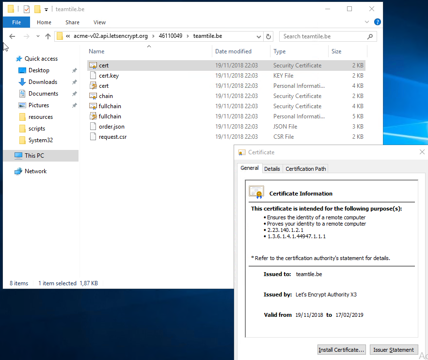

## 3. Request Certificate for the environment

We will be using remote desktop services to expose an ssh client to our users. This will be done by a website, the RDWEB compononent of a remote desktop services environment.

To adhere to security best practices we need to assign a public certificate from a well known certificate authority to our websites. We will be using [Let's Encrypt](https://letsencrypt.org/).

Run `./start.ps1 -DeelCertificate` [:memo:](../scripts/RequestCertificate.ps1)

Our domain name (for this demo `teamtile.be`) is hosted on the same Azure subscription. This script wil create a `.csr` for our domain name. To prove ownership of the domain name we need to create a `TXT` record in the zone. After a sleep of 300 seconds `Let's Encrypt` will query this record. When this is succesfull we receive a certificate (`.cert`, `.pfx`) and a full certificate chain (`.pfx`).

[Vorige](./2.CreateTheMachines.md) - [Index](./index.md) - [Volgende](./4.CreateTheRDSFarm.md)