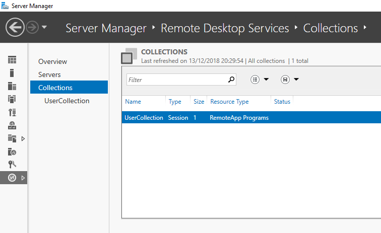

## 5. Publish the RDS applications

To be able to use the applications on the RDWEB site. We need to create a collection and publish the applications.

Run `./start.ps1 -DeelPublishApps` [:memo:](../scripts/PublishRDSApplications.ps1)

Again the Azure runbook is called, this time to run `./PublishRDSApplications.ps1`. This script will create a new session collection and publish the applications.

[Vorige](./4.CreateTheRDSFarm.md) - [Index](./index.md) - [Volgende](./6.Office365Trial.md)