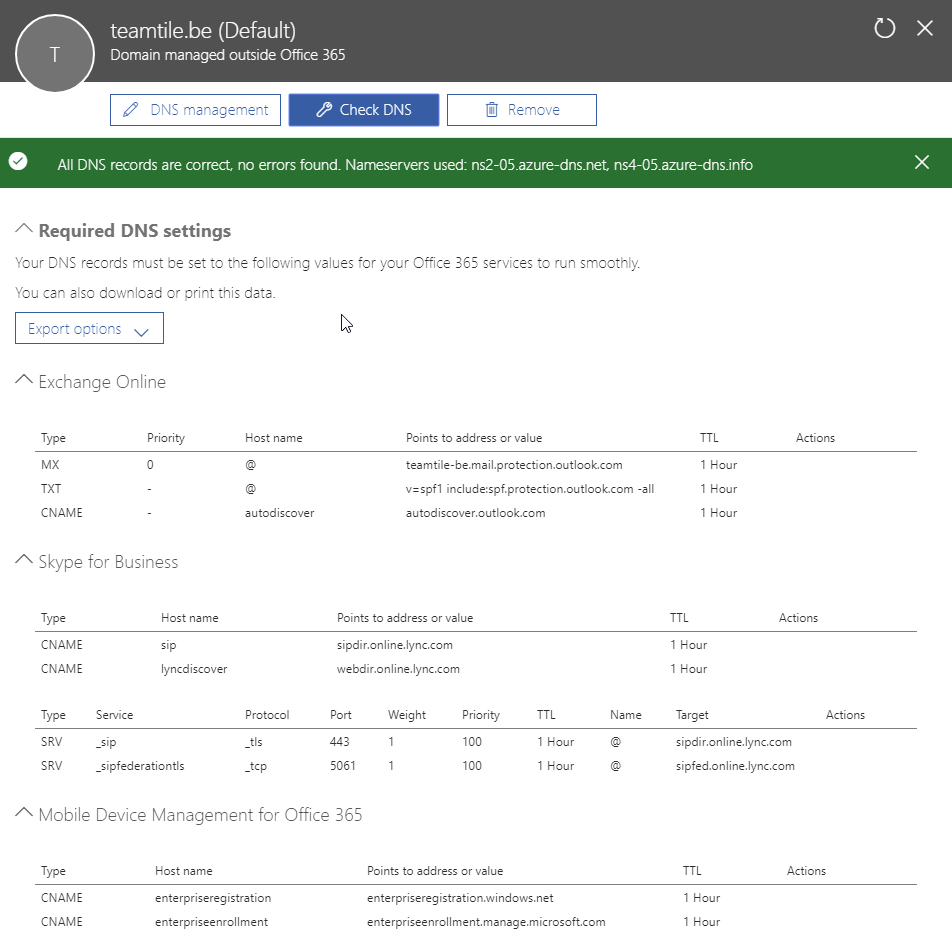

## 6. Office 365 Trial

We make use of Office 365 for our back office products. Office 365 is a suite of software products hosted in the cloud the most notable features are

- Exchange
- Skype for Business / Teams
- Sharepoint
- Onedrive

The steps taken are

- Create a new mail adres `teamtile@outlook.com`, just to get started.
- Request an Office 365 E3 trial subscription with the new mail address. Our tenant is `teamtile.onmicrosoft.com` the admin account is `admin@teamtile.onmicrosoft.com`

After creating the subscription we need to configure the subscription. We need to link our domain name `teamtile.be`. To do so, first we need to prove that we are the owner of that domain. We need to create a `TXT` record. The wizard will then verify this record.

The script `CreateO365DNSRecordsInAzure.ps1` [:memo:](../scripts/CreateO365DNSRecordsInAzure.ps1) does this for us. It will also create the required records for Office 365 to function properly. More information about these records can be found [here](https://docs.microsoft.com/en-us/office365/admin/get-help-with-domains/create-dns-records-at-any-dns-hosting-provider?view=o365-worldwide).

[Previous](./5.PublishTheRDSAppllications.md) - [Index](./index.md) - [Next](./7.SyncronizeOnPremAD.md)